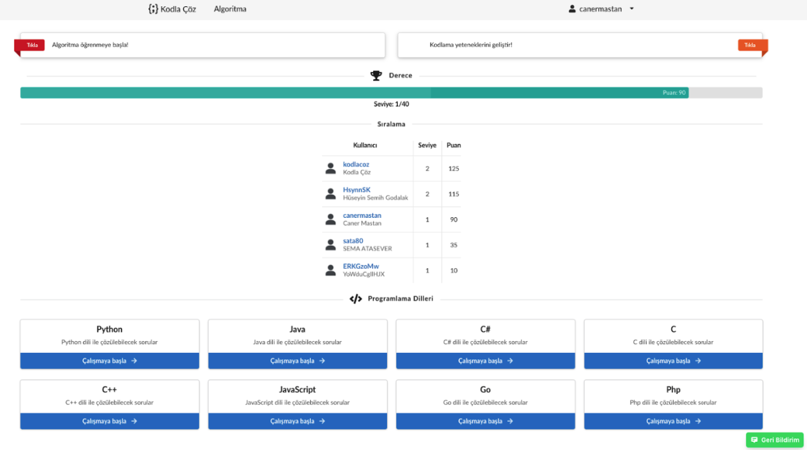
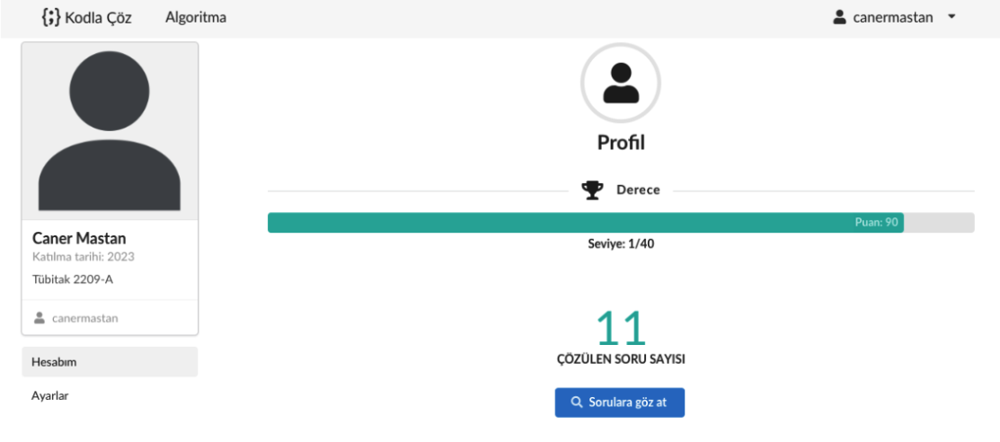
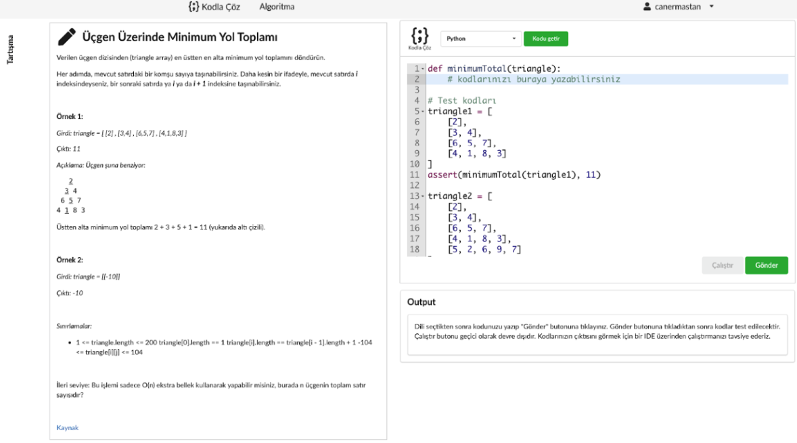
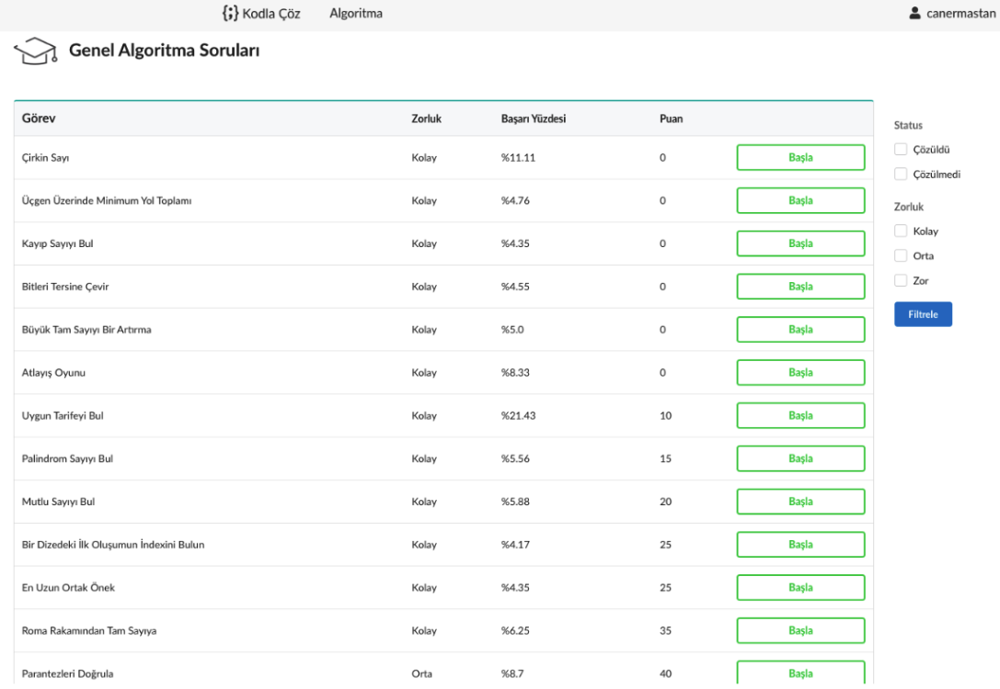

# Algorithm Practice Platform

This project is an online platform designed to help users enhance their algorithmic skills by solving various algorithm challenges. It provides a wide range of tasks, from beginner to advanced, aimed at improving problem-solving and coding abilities. The platform is designed to offer a smooth and engaging user experience with a clean and intuitive interface.

## Overview

The project was developed between 2021 and 2022 as part of the TÜBİTAK 2209-A Program and received support under this initiative. An academic paper was also published in 2022 regarding the project.

The platform is built with Java 17 and utilizes PostgreSQL as the database solution. For system monitoring, a `docker-compose-monitoring.yml` file is included, which integrates Prometheus and Grafana for performance and health monitoring.

Unfortunately, the development of this project was discontinued in 2022, but it remains a comprehensive solution for algorithm practice and learning.

## Academic Paper

An academic paper regarding this project was published in 2024. You can read the paper at the following link:

[Link to the Academic Paper](https://drive.google.com/file/d/1vgYVIBxs79jEOunlz36HrfwnWckoma_U/view?usp=sharing)

## Features

- **Multiple Programming Languages**: Users can solve algorithm problems in a variety of programming languages, including Java, Python, C++, JavaScript, and more. The platform supports 8 different programming languages, allowing users to choose the language they are most comfortable with.

- **Algorithm Challenges**: A wide range of algorithmic problems are available, categorized by difficulty and topic. Users can solve problems, submit their solutions, and track their progress over time.

- **Profile Viewing**: Users can explore the profiles of other participants to see their achievements, solutions, and rankings. This feature allows for social interaction, competition, and learning from others' approaches to solving problems.

- **Leaderboards**: A ranking system that shows the top users based on the number of problems solved and their solution efficiency. This encourages healthy competition and motivates users to improve their skills.

- **Task Page**: Each task has a detailed description, input/output specifications, and example test cases. Users can view and attempt tasks, check their solutions against the test cases, and see the result of their submission.

- **Progress Tracking**: Users can track their learning progress, view their solved problems, and monitor their improvement over time. Progress is displayed visually on the profile page, including statistics like total problems solved, accuracy, and ranking.

- **Task Submission and Evaluation**: After solving a problem, users can submit their code to be evaluated. The system runs automated test cases to check if the solution is correct and performs efficiently.

- **Discussion and Collaboration**: Users can discuss tasks and solutions with others on the platform, share insights, and help each other learn. This fosters a community-driven learning environment.

- **Profile Customization**: Users can customize their profiles, including adding a profile picture, setting their bio, and choosing their preferred programming languages for solving tasks.

## Technology Stack

- **Backend**: Java 17
- **Database**: PostgreSQL
- **Frontend**: Thymeleaf for rendering dynamic content
- **Monitoring**: Docker with Prometheus and Grafana for performance monitoring
- **Docker Compose**: `docker-compose-monitoring.yml` for container orchestration

## Project Screenshots

### Home Page


### Profile Page


### Task Page


### Task List Page


## Installation

To run the project locally, follow the steps below:

1. Clone the repository:

   ```bash
   git clone <repository_url>
    ```

2. Navigate to the project directory:
      ```bash
   cd <project_directory>
    ```

3. Set up the environment and database.

4. Run the application using your preferred IDE or build tool (e.g., Maven, Gradle).

5. For monitoring, use the docker-compose-monitoring.yml file to set up Prometheus and Grafana.

### Contributing
Feel free to fork the repository and submit pull requests with improvements or bug fixes. All contributions are welcome!

### License
This project is licensed under the MIT License - see the LICENSE file for details.